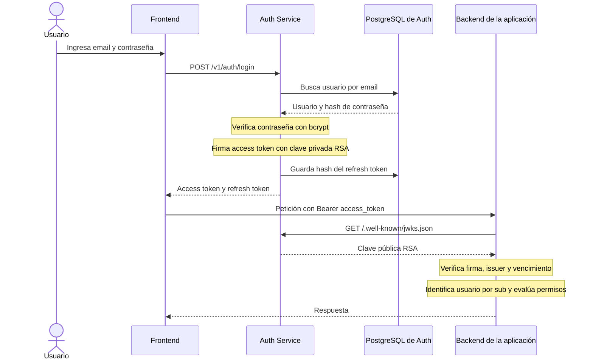
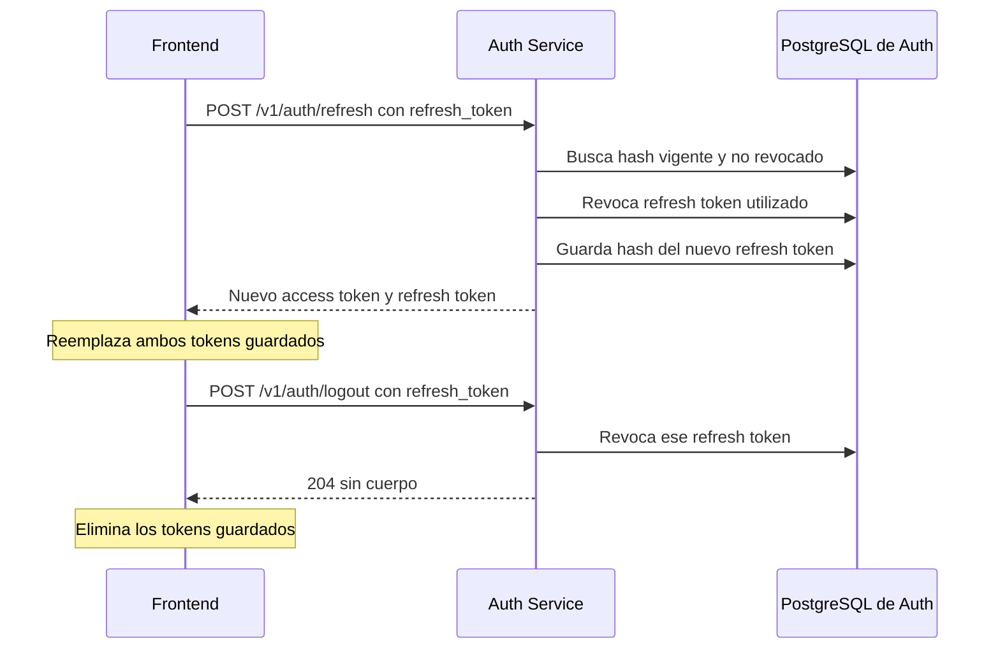

# Auth Service

Servicio de identidad reutilizable para aplicaciones propias. Gestiona usuarios,
contraseñas hasheadas, access tokens JWT firmados con RS256 y refresh tokens
opacos con rotación.

Las aplicaciones consumidoras conservan sus perfiles y reglas de negocio. Este
servicio solo identifica al usuario mediante el claim JWT `sub`.

## Flujo

1. Una aplicación registra o autentica a un usuario en este servicio.
2. Recibe un access token de 15 minutos y un refresh token de 30 días.
3. La API consumidora valida el access token contra `/.well-known/jwks.json`.
4. La API usa el `sub` como identificador estable del usuario en su propia base.

## Funcionamiento de autenticación

El Auth Service centraliza usuarios, credenciales y sesiones. Cada aplicación conserva sus datos, permisos y reglas de negocio, vinculados al usuario mediante el claim `sub` del access token.



La validación del JWT debe implementarse en cada backend consumidor. La clave pública puede almacenarse en caché; no es necesario consultar al Auth Service en cada petición.

### Claves y tokens

- **Clave privada RSA:** permanece secreta en `AUTH_PRIVATE_KEY_PEM`. Firma los access tokens y debe conservarse entre reinicios y deploys, compartida por todas las instancias del servicio.
- **Clave pública RSA:** se publica en `/.well-known/jwks.json` y permite verificar las firmas.
- **Access token:** JWT enviado como credencial a las APIs; dura 15 minutos por defecto.
- **Refresh token:** token opaco cuyo hash se guarda en PostgreSQL; dura 30 días por defecto y se reemplaza en cada renovación.
- **Rotación de clave:** con la implementación actual, reemplazar la clave impide validar tokens anteriores con la nueva clave publicada. Los consumidores que conserven la clave anterior en caché pueden seguir aceptándolos hasta actualizarla o hasta que venzan.

### Renovación y cierre de sesión



El logout revoca el refresh token indicado. El access token ya emitido sigue siendo válido hasta su vencimiento. Actualmente las aplicaciones comparten un único conjunto de usuarios.

## Endpoints

| Método | Ruta | Uso |
| --- | --- | --- |
| `POST` | `/v1/auth/register` | Crea un usuario e inicia sesión. |
| `POST` | `/v1/auth/login` | Inicia sesión con email y contraseña. |
| `POST` | `/v1/auth/refresh` | Rota el refresh token y emite nuevos tokens. |
| `POST` | `/v1/auth/logout` | Revoca un refresh token. |
| `GET` | `/v1/auth/me` | Devuelve el usuario autenticado. |
| `GET` | `/.well-known/jwks.json` | Expone la clave pública para validar JWT. |
| `GET` | `/health` | Estado del servicio. |

## Desarrollo local

### Organización por capas

- `internal/controllers/<domain>`: entrada HTTP, validación de requests y respuestas. Cada paquete expone `Controller` y `New`.
- `internal/services/<domain>`: casos de uso y coordinación de reglas de negocio; depende de contratos del dominio.
- `internal/domain/<domain>`: entidades, errores y contratos de repositorio, sin dependencias de HTTP ni GORM.
- `internal/repositories/<domain>`: persistencia con GORM, modelos de base de datos y traducción de errores al dominio.

`cmd/server` conecta las implementaciones. `internal/http` configura rutas y
middleware; `internal/config` y `internal/database` contienen infraestructura.
Los nombres de paquetes y carpetas se mantienen en inglés. Se preservan las
rutas y los contratos públicos de la API.

```bash
cp .env.example .env
docker compose up -d postgres
go mod tidy
go run ./cmd/server
```

En desarrollo, si falta `AUTH_PRIVATE_KEY_PEM`, el servicio genera una clave RSA
temporal al iniciar. En producción esa variable es obligatoria y debe contener
una clave privada RSA en formato PEM.

## Ejemplo de registro

```bash
curl -X POST http://localhost:8081/v1/auth/register \
  -H 'Content-Type: application/json' \
  -d '{"email":"ana@example.com","password":"una-clave-segura","name":"Ana"}'
```

La contraseña debe tener al menos 12 caracteres.
